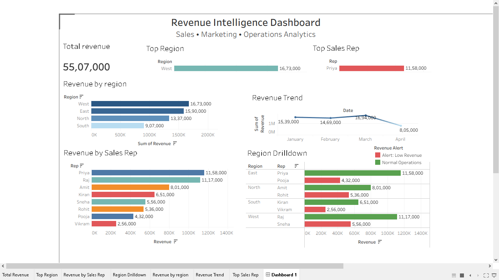

# Revenue Intelligence Dashboard

## Project Overview
An interactive Tableau dashboard designed to monitor revenue performance across regions and sales representatives.

## Features
- Revenue KPI Tracking
- Top Region Analysis
- Top Sales Representative Identification
- Revenue Trend Analysis
- Region-to-Rep Drilldown
- Automated Revenue Alerting

## Tools Used
- Tableau Public
- Microsoft Excel

## Key Insights
- West Region generated the highest revenue.
- Priya was the top-performing sales representative.
- Revenue anomalies were identified using calculated fields.

## Dashboard Preview

## Skills Demonstrated
- Business Intelligence
- Data Visualization
- KPI Design
- Dashboard Development
- Anomaly Detection
## Live Dashboard

[View Interactive Dashboard](https://public.tableau.com/app/profile/soumyadip.mallick/viz/Revenue_Intelligence_Dashboard1/Dashboard1)
